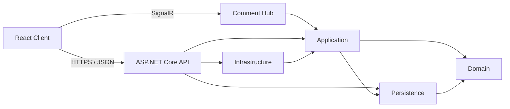

# Reactivities 2025 — Full-Stack Social Activity Platform

## Overview

Reactivities 2025 is a full-stack social activity application. Authenticated users can create and manage activities, attend events, view member profiles, follow other users, upload profile photos, and discuss an activity through real-time comments.

The repository demonstrates a React single-page application backed by an ASP.NET Core API, a layered .NET solution, CQRS-style request handling with MediatR, Entity Framework Core persistence, ASP.NET Core Identity, policy-based authorization, and SignalR communication.

## Features

- Activity creation, editing, deletion, attendance, date filtering, and cursor-based pagination
- Member profiles, photos, follow relationships, and hosted/attending activity views
- Real-time activity comments over SignalR
- Registration, email confirmation, login, logout, password reset/change, and protected routes
- GitHub and Google sign-in integrations
- Host-only authorization for editing and deleting activities
- Map-based activity locations with Leaflet
- Cloudinary photo storage and Resend transactional email integration

## Architecture

The backend is split into five .NET 9 projects:

- **API** — ASP.NET Core controllers, Identity endpoints, middleware, dependency configuration, SignalR hub, static client hosting, and application startup.
- **Application** — activity and profile use cases implemented as MediatR commands and queries, plus DTOs, validation, mapping, pagination, and service abstractions.
- **Domain** — core entities for users, activities, attendance, comments, photos, and following relationships.
- **Persistence** — the Entity Framework Core `DbContext`, migrations, relational configuration, and development seed data.
- **Infrastructure** — implementations for current-user access, host authorization, Cloudinary photo handling, and Resend email delivery.



The client is a React 19 and TypeScript application built with Vite. It uses Material UI for the interface, React Router for navigation, TanStack Query for server state, MobX for client-side state, Axios for HTTP requests, React Hook Form with Zod for forms and validation, and the SignalR client for live comments. A production client build is emitted into `API/wwwroot`, where the API serves it with a fallback route for client-side navigation.

## Technology Stack

| Area | Technologies |
| --- | --- |
| Backend | .NET 9, ASP.NET Core Web API, MediatR, AutoMapper, FluentValidation |
| Data | Entity Framework Core 9, SQLite for local development, EF Core migrations |
| Identity | ASP.NET Core Identity, cookie-based API authentication, GitHub and Google OAuth |
| Frontend | React 19, TypeScript, Vite, Material UI, React Router |
| State and data | TanStack Query, MobX, Axios |
| Real time | ASP.NET Core SignalR, Microsoft SignalR client |
| Integrations | Cloudinary, Resend, Leaflet/OpenStreetMap |

## Project Structure

```text
Reactivities.sln
├── API/             # HTTP and SignalR entry points; application composition
├── Application/     # Commands, queries, DTOs, validation, and mapping
├── Domain/          # Business entities
├── Infrastructure/  # External services and security implementations
├── Persistence/     # EF Core context, migrations, and seed data
└── client/          # React and TypeScript single-page application
```

## Engineering Practices

- Layered architecture with clear separation between API, application, domain, persistence, and infrastructure concerns
- CQRS-style command and query handling with MediatR
- Dependency injection and service abstractions
- FluentValidation for request validation
- Entity Framework Core migrations and relational mapping
- Policy-based authorization for activity ownership
- Real-time communication using SignalR
- Strongly typed DTO mapping with AutoMapper
- Cursor-based pagination and server-side filtering
- External service abstractions for photo storage and transactional email
## Getting Started

### Prerequisites

- .NET 9 SDK
- Node.js and npm

### Configuration

Local development uses SQLite with `Data source=reactivities.db` in `API/appsettings.Development.json`. The API applies migrations and seeds development data when it starts.

Configure the external integrations used by the application through ASP.NET Core configuration:

- `CloudinarySettings`: `CloudName`, `ApiKey`, `ApiSecret`
- `Resend`: `ApiToken`
- `Authentication:GitHub`: OAuth application values
- `Authentication:Google`: OAuth application values
- `ClientAppUrl`: client origin used in authentication and email links

The client development environment expects:

```dotenv
VITE_API_URL=https://localhost:5001/api
VITE_COMMENTS_URL=https://localhost:5001/comments
VITE_GITHUB_CLIENT_ID=<github-client-id>
VITE_REDIRECT_URL=<github-callback-url>
```

`VITE_GITHUB_CLIENT_ID` reflects the variable name currently referenced by the client source.

### Run locally

Restore and start the API:

```bash
dotnet restore
dotnet run --project API
```

In another terminal, install the client packages and start Vite:

```bash
cd client
npm install
npm run dev
```

The configured development endpoints are `https://localhost:5001` for the API and port `3000` for the client.

## Build

Build the backend solution:

```bash
dotnet build Reactivities.sln
```

Build the client into `API/wwwroot`:

```bash
cd client
npm run build
```
## Project Status

This is a portfolio project demonstrating modern full-stack application development with ASP.NET Core, React, CQRS, real-time communication, authentication, external integrations, and layered application architecture.

## Author

**Antonio Cruz**  
Senior .NET / Full Stack Engineer

[GitHub Profile](https://github.com/tonycruz-dev)